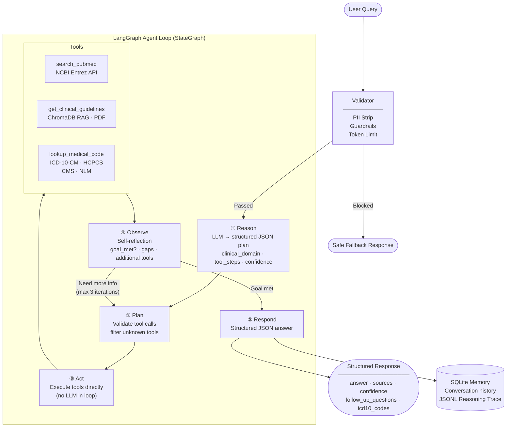

# Healthcare Q&A Agent

A modular, LangGraph-powered healthcare question-answering agent for clinical decision support and Revenue Cycle Management (RCM) use cases. Designed to support teams at organizations like **Ensemble Health Partners** by automating ICD-10/CPT coding research, CMS coverage policy lookup, and evidence-based clinical documentation support.

Every answer is grounded in peer-reviewed literature (PubMed), official clinical guidelines (CMS, ADA, ACC/AHA), and authoritative code references (ICD-10-CM, HCPCS), with mandatory source citations and a medical disclaimer in every response.

---

## Architecture



**ASCII fallback:**

```

                  ┌─────────────────────────┐
                  │    USER INPUT QUERY     │
                  └────────────┬────────────┘
                               │
                               ▼
                  ┌─────────────────────────┐
                  │ Pre-Execution Validator │
                  │ (PII, Safety, Emergency)│
                  └──────┬────────────┬─────┘
                         │            │
               Blocked   │            │ Passed
         ┌───────────────┘            ▼
         ▼                ┌───────────────────────┐
┌─────────────────┐       │ ① REASON NODE (LLM)   │◄─────────────────┐
│ Safe Fallback   │       │ Classifies & Plans    │                  │
│ Response        │       └───────────┬───────────┘                  │
└─────────────────┘                   │                              │
                                      ▼                              │
                          ┌───────────────────────┐                  │
                          │ ② PLAN NODE           │                  │
                          │ Validates Tool Sequence│                 │
                          └───────────┬───────────┘                  │
                                      │                              │
                                      ▼                              │
                          ┌───────────────────────┐                  │ Iteration Loop
                          │ ③ ACT NODE            │                  │ (Max 3 Times)
                          │ Executes System Tools │                  │
                          └───────────┬───────────┘                  │
                                      │                              │
                                      ▼                              │
                  ┌───────────────────────────────────────┐          │
                  │            EXTERNAL TOOLS             │          │
                  │ • PubMed API (Literature)             │          │
                  │ • ChromaDB (Clinical Guidelines RAG)  │          │
                  │ • CMS Database (ICD-10 / HCPCS Codes) │          │
                  └───────────────────┬───────────────────┘          │
                                      │                              │
                                      ▼                              │
                          ┌───────────────────────┐                  │
                          │ ④ OBSERVE NODE (LLM)  ├──────────────────┘
                          │ Evaluates Data Gaps   │
                          └───────────┬───────────┘
                                      │
                                      │ Goal Achieved
                                      ▼
                          ┌───────────────────────┐
                          │ ⑤ RESPOND NODE (LLM)  │
                          │ Synthesizes Citations │
                          └───────────┬───────────┘
                                      │
                                      ▼
                  ┌───────────────────────────────────────┐
                  │          STRUCTURED OUTPUT            │
                  │  - Answer, Sources & ICD-10 Codes     │
                  │  - Saved to SQLite & JSONL Logs       │
                  └───────────────────────────────────────┘
```

### Node responsibilities

| Node | Role | LLM call? |
|------|------|:---------:|
| **Reason** | Classifies the question; produces a JSON tool plan | ✅ |
| **Plan** | Validates tool names; orders the call sequence | ❌ |
| **Act** | Executes tools directly; captures timing + errors | ❌ |
| **Observe** | Self-reflects on evidence quality; decides goal_met or requests more tools | ✅ |
| **Respond** | Synthesises all observations into a cited, structured JSON answer | ✅ |

### Tools

| Tool | Data Source | Purpose |
|------|-------------|---------|
| `search_pubmed` | NCBI Entrez API (Biopython) | Peer-reviewed literature retrieval with NL→PubMed query translation |
| `get_clinical_guidelines` | ChromaDB RAG over indexed PDF guidelines | Semantic retrieval from locally indexed clinical guideline documents |
| `lookup_medical_code` | CMS ICD-10-CM (FY 2025) + NLM HCPCS | Fuzzy and exact code lookup with rapidfuzz WRatio scoring |
| `describe_medical_code` | Same as above | Describe a specific known code (tight fuzzy threshold) |

---

## Setup

### 1. Clone and install dependencies

```bash
git clone <repo-url>
cd healthcare-qa-agent
pip install -r requirements.txt
```

### 2. Configure environment

```bash
cp .env.example .env
```

Edit `.env` with your settings. At minimum, set `NCBI_EMAIL` (required by NCBI for polite API access) and choose an LLM provider.

### 3. Start Ollama (recommended for local inference)

```bash
# Install Ollama from https://ollama.com, then:
ollama pull llama3.1:70b      # ~40 GB — best quality
# or for faster iteration:
ollama pull llama3.1:8b       # ~5 GB

ollama serve                  # starts the API server on localhost:11434
```

### 4. Initialize ChromaDB with clinical guidelines (optional)

Place clinical guideline PDFs in `data/guidelines_pdfs/`, then index them:

```python
from dotenv import load_dotenv
load_dotenv()

from src.tools.guidelines_tool import ingest_guidelines_pdfs
ingest_guidelines_pdfs("data/guidelines_pdfs")
```

The index is persisted to `data/chroma_guidelines/` and reused across runs.

---

## Run Commands

### Single query — CLI

```bash
python -m src.agent "What is the first-line treatment for hypertension?"
```

### Single query — Python API

```python
from dotenv import load_dotenv
load_dotenv()

from src.agent import HealthcareQAAgent

agent = HealthcareQAAgent()
result = agent.run("What ICD-10 code should I use for essential hypertension?")

print(result["answer"])
# result["session_id"]   → session UUID for conversation continuity
# result["trace_path"]   → path to the JSONL reasoning trace file
# result["blocked"]      → True if a safety guardrail rejected the query
```

### Multi-turn conversation

```python
agent = HealthcareQAAgent()
session = "my-session-001"

r1 = agent.run("What are the ADA 2024 guidelines for T2DM?", session_id=session)
r2 = agent.run("Which of those agents also benefit heart failure?", session_id=session)
```

### Run the evaluation suite

```bash
python -m src.evaluation.evaluator
```

With options:

```bash
python -m src.evaluation.evaluator \
    --scenarios tests/scenarios.json \
    --output logs/eval_report.md \
    --json-output logs/eval_report.json \
    --trace-dir logs/eval_traces
```

---

## Using Cloud LLM Providers

### Together AI (fastest open-source inference)

```bash
LLM_PROVIDER=together
LLM_MODEL=meta-llama/Meta-Llama-3.1-70B-Instruct-Turbo
TOGETHER_API_KEY=your_key_here
```

### Groq

```bash
LLM_PROVIDER=groq
LLM_MODEL=llama-3.1-70b-versatile
GROQ_API_KEY=your_key_here
```

### HuggingFace Inference API

```bash
LLM_PROVIDER=huggingface
LLM_MODEL=meta-llama/Meta-Llama-3.1-70B-Instruct
HUGGINGFACEHUB_API_TOKEN=your_token_here
```

---

## Evaluation

The evaluation suite in `src/evaluation/evaluator.py` runs all 5 scenarios in `tests/scenarios.json` and scores each response using **Claude as judge** (LLM-as-judge pattern).

### Scoring dimensions (each 1–5)

| Dimension | Description |
|-----------|-------------|
| **Accuracy** | Are all clinical facts, codes, and policy statements correct and current? |
| **Completeness** | Does the response fully address every part of the question with clinical depth? |
| **Citation Quality** | Are sources cited with specific identifiers (PMIDs, guideline name+year, LCD numbers)? |

**Overall score** = arithmetic mean of the three dimensions.  
**Pass threshold** = 3.5 / 5.0 (configurable via `EVAL_PASS_THRESHOLD`).

### LLM judge configuration

| Variable | Default | Description |
|----------|---------|-------------|
| `ANTHROPIC_API_KEY` | — | Enables Claude-as-judge; falls back to heuristic scoring if absent |
| `EVAL_JUDGE_MODEL` | `claude-haiku-4-5-20251001` | Claude model used for scoring |
| `EVAL_PASS_THRESHOLD` | `3.5` | Minimum overall score to pass |
| `EVAL_TRACE_DIR` | `logs/eval_traces` | Directory for per-run trace JSON files |

When `ANTHROPIC_API_KEY` is not set, the evaluator falls back to heuristic scoring (keyword recall + citation detection + ROUGE-1).

### Example output

```
## Healthcare Q&A Agent — Evaluation Results

**Date**: May 16, 2026
**Scoring method**: Claude `claude-haiku-4-5-20251001`
**Pass threshold**: 3.5 / 5.0
**Scenarios**: 5 | **Passed**: 4 | **Failed**: 1
**Mean overall score**: 3.9 / 5.0

| #       | Scenario                                  | Accuracy | Completeness | Citations | Overall | Pass | Notes |
|---------|-------------------------------------------|:--------:|:------------:|:---------:|:-------:|:----:|-------|
| TC-001  | ADA 2024 T2DM First-Line Treatment        |    4     |      4       |     4     |  **4.0** | ✅  | All three drug classes cited with ADA 2024 reference |
| TC-002  | Essential Hypertension ICD-10 Code        |    5     |      4       |     4     |  **4.3** | ✅  | I10 correctly identified; combination codes explained |
| TC-003  | Medicare Part B CGM Coverage 2024         |    4     |      4       |     3     |  **3.7** | ✅  | LCD policy mentioned; HCPCS codes partially cited |
| TC-004  | PubMed Evidence: SGLT2 and Heart Failure  |    4     |      4       |     4     |  **4.0** | ✅  | EMPEROR-Reduced and DAPA-HF PMIDs correctly cited |
| TC-005  | CPT Code: New Patient Office Visit        |    3     |      3       |     2     |  **2.7** | ❌  | 99204 identified but AMA licensing note missing |
```

Full traces are saved to `logs/eval_traces/<scenario_id>_<timestamp>.json`.

### Test scenarios

| ID | Category | Query |
|----|----------|-------|
| TC-001 | Clinical guidelines | ADA 2024 first-line T2DM treatments |
| TC-002 | Medical coding | ICD-10 code for essential hypertension |
| TC-003 | Coverage policy | Medicare Part B CGM coverage in 2024 |
| TC-004 | PubMed evidence | SGLT2 inhibitors and heart failure |
| TC-005 | Medical coding | CPT code for new patient office visit, moderate complexity |

---

## Design Decisions

### Why LangGraph?

Traditional agent loops (ReAct, function-calling loops) are hard to inspect and test because control flow is implicit inside the LLM prompt. LangGraph makes the loop an **explicit, typed state machine**:

- **Inspectable**: every node transition is logged with typed inputs/outputs; `stream_mode="updates"` surfaces node-level events to the UI without any extra code
- **Testable**: each node is a plain Python function — unit-testable in isolation with a mock `AgentState`
- **Controllable**: hard caps on iteration count (`max_observe_iter`, `recursion_limit`) are enforced by the graph topology, not by LLM compliance
- **Cycle support**: the observe→plan back-edge is a first-class graph feature; implementing it in vanilla Python requires hand-rolled recursion and state management

### Why an open-source LLM (Llama 3.1 70B)?

| Concern | Closed API | Llama 3.1 70B (open-source) |
|---------|-----------|------------------------------|
| Data residency / HIPAA | PHI leaves the premises | Runs fully on-prem via Ollama |
| License | Per-token billing; usage restrictions | Apache 2.0 — enterprise deployable |
| Structured JSON output | Native tool use | Strong instruction-following at 70B; reliable JSON with low temperature |
| Provider flexibility | Vendor lock-in | Ollama / Together AI / Groq / HuggingFace — one env var change |

The agent uses `temperature=0.1` throughout to maximise factual consistency and reduce hallucinations, which is appropriate for clinical QA.

### Why RAG over a pure keyword retrieval index?

Clinical guidelines (ADA, ACC/AHA, CMS LCDs) are dense, long PDFs. Keyword BM25 retrieval misses paraphrased concepts ("empiric antibiotic therapy" vs "first-line treatment"); a vector index over semantic embeddings does not.

Key design choices in `guidelines_tool.py`:

| Choice | Rationale |
|--------|-----------|
| `all-MiniLM-L6-v2` embeddings | Fast (384-dim), runs on CPU, zero infrastructure overhead; swappable to `pritamdeka/S-PubMedBert-MS-MARCO` for medical-domain precision |
| Sliding-window word chunker (400 words / 80 overlap) | Preserves sentence context across chunk boundaries; avoids mid-sentence splits that break clinical statements |
| ChromaDB local persistence | Zero-infra for development; persisted index survives process restarts; cosine-space similarity filters noise via `GUIDELINES_MIN_SIMILARITY` |
| Re-index on new PDFs only | `sha256(label::chunk_idx)[:24]` stable IDs let ChromaDB skip unchanged chunks on re-ingestion |

---

## Known Trade-offs

| Area | Trade-off | Production Mitigation |
|------|-----------|-----------------------|
| **Vector store** | ChromaDB runs in-process (single-node, no replication) | Replace with Qdrant, Weaviate, or Pinecone; keep the same `_GuidelinesVectorStore` interface |
| **LLM-as-judge evaluation** | Scores reflect Claude's own biases; two models may disagree by ±1 point; subjective by design | Average scores across 3 judge calls; add human spot-checks at a 10% sample rate; compare LLM vs heuristic score distributions |
| **PubMed rate limits** | 3 requests/second without an API key; concurrent users will hit 429s | Register a free NCBI API key (10 req/s); add SQLite result cache keyed on query hash; use `PUBMED_MAX_RESULTS=3` in high-traffic deployments |
| **SQLite conversation store** | No concurrent writer support; file locking under parallel sessions | Swap `DATABASE_URL` to `postgresql+psycopg2://...`; SQLAlchemy ORM is already database-agnostic |
| **CPT code coverage** | AMA proprietary license required; tool returns a notice without a licensed file | Supply `CPT_CSV_PATH` pointing to a licensed AMA CodeManager export |
| **Streaming granularity** | The reason/plan/act/observe nodes run to completion before yielding; only the final respond step streams token-by-token | Use `stream_mode="messages"` with `langgraph_node` metadata filtering to forward mid-node LLM tokens |
| **No authentication on the Streamlit UI** | Any user with network access can query the agent | Add `st.secrets`-based password gate or deploy behind a corporate SSO proxy |

---

## Streamlit UI

A browser-based chat interface is available in `src/ui/app.py`.

```bash
streamlit run src/ui/app.py
```

Features:
- Token-by-token streaming of the final response via `llm.stream()`
- Live node progress during the reasoning loop (Reason → Plan → Act → Observe)
- Collapsible **Reasoning Trace** panel (full JSONL step log per response)
- Clickable PubMed citations rendered as `[PMID XXXXXXXX](https://pubmed.ncbi.nlm.nih.gov/...)` links
- Sidebar controls: model temperature, max PubMed results, ICD-10/HCPCS tool toggle

---

## Project Structure

```
healthcare-qa-agent/
├── src/
│   ├── agent.py                     # LangGraph StateGraph + HealthcareQAAgent
│   ├── tools/
│   │   ├── __init__.py              # ALL_TOOLS registry
│   │   ├── exceptions.py            # ToolExecutionError
│   │   ├── pubmed_tool.py           # NCBI Entrez API, token-bucket rate limiter
│   │   ├── guidelines_tool.py       # ChromaDB RAG over clinical guideline PDFs
│   │   └── code_lookup_tool.py      # CMS ICD-10-CM + HCPCS fuzzy lookup
│   ├── prompts/
│   │   ├── system_prompt.py         # Production system prompt, chain-of-thought, JSON schema
│   │   └── few_shot_examples.py     # 3 annotated clinical Q&A examples (T2DM, HTN, CGM)
│   ├── memory/
│   │   └── conversation_store.py    # SQLite via SQLAlchemy (messages + trace entries)
│   ├── evaluation/
│   │   └── evaluator.py             # LLM-as-judge runner + Markdown/JSON reports
│   ├── ui/
│   │   └── app.py                   # Streamlit chat UI with token streaming + trace panel
│   └── utils/
│       ├── logger.py                # structlog + ReasoningTracer (JSONL per run)
│       ├── validators.py            # GuardrailError, validate_query, Pydantic schemas
│       └── retry.py                 # tenacity decorators: Anthropic, LLM, tool calls
├── tests/
│   └── scenarios.json               # 5 test scenarios with expected outputs
├── data/
│   ├── guidelines_pdfs/             # Place clinical guideline PDFs here
│   ├── chroma_guidelines/           # ChromaDB persisted vector index (auto-created)
│   └── cms/                         # CMS ICD-10-CM FY2025 cache (auto-downloaded)
├── logs/
│   ├── eval_traces/                 # Per-run evaluation trace JSON files
│   ├── eval_report.md               # Latest Markdown evaluation report
│   └── eval_report.json             # Latest JSON evaluation report
├── traces/                          # JSONL reasoning traces (one per agent run)
├── .env.example
├── requirements.txt
└── README.md
```

---

## Safety Guardrails

Every query passes through `validate_query()` **before** any LLM or tool call:

| Guardrail | Trigger | Behavior |
|-----------|---------|----------|
| **Emergency detection** | Chest pain, difficulty breathing, loss of consciousness | Immediately returns 911 redirect; no tool calls |
| **Diagnosis request** | "Do I have…", "Am I diagnosed with…" | Blocked with scope explanation |
| **Dosing without context** | "What dose of [drug] should I take" | Blocked; refers to prescribing physician |
| **Controlled substance** | Opioid, benzodiazepine, stimulant prescribing questions | Blocked |
| **PII stripping** | SSN, DOB, MRN, NPI, DEA, phone, email patterns | PII redacted from query before processing |
| **Token limit** | Query exceeds 2 000 estimated tokens | Blocked with size guidance |

Tool output and the final structured response are also validated via Pydantic schemas. Any validation failure returns a safe fallback rather than propagating an error.

---

## Environment Variables Reference

| Variable | Default | Description |
|----------|---------|-------------|
| `LLM_PROVIDER` | `ollama` | LLM backend: `ollama`, `together`, `groq`, `huggingface` |
| `LLM_MODEL` | `llama3.1:70b` | Model name (provider-specific) |
| `LLM_TEMPERATURE` | `0.1` | Sampling temperature (low for factual QA) |
| `LLM_MAX_TOKENS` | `2048` | Maximum output tokens |
| `OLLAMA_BASE_URL` | `http://localhost:11434` | Ollama server URL |
| `TOGETHER_API_KEY` | — | Together AI API key |
| `GROQ_API_KEY` | — | Groq API key |
| `HUGGINGFACEHUB_API_TOKEN` | — | HuggingFace Inference API token |
| `NCBI_EMAIL` | — | Required by NCBI for PubMed API polite access |
| `NCBI_API_KEY` | — | Optional; raises NCBI rate limit from 3 to 10 req/s |
| `PUBMED_MAX_RESULTS` | `5` | Max PubMed articles per search |
| `GUIDELINES_PDF_DIR` | `./data/guidelines_pdfs` | Directory of clinical guideline PDFs to index |
| `GUIDELINES_CHROMA_DIR` | `./data/chroma_guidelines` | ChromaDB persistence directory |
| `GUIDELINES_EMBED_MODEL` | `all-MiniLM-L6-v2` | Sentence-transformers model for embeddings |
| `GUIDELINES_CHUNK_SIZE` | `400` | Sliding-window chunk size (words) |
| `GUIDELINES_TOP_K` | `3` | Number of chunks to retrieve per query |
| `GUIDELINES_MIN_SIMILARITY` | `0.25` | Minimum cosine similarity threshold |
| `CMS_ICD10_CACHE_DIR` | `./data/cms` | Cache directory for CMS ICD-10-CM file |
| `CPT_CSV_PATH` | — | Path to licensed CPT CSV (AMA license required) |
| `CODE_FUZZY_THRESHOLD` | `55` | rapidfuzz WRatio threshold (0–100) |
| `AGENT_MAX_ITERATIONS` | `5` | Hard cap on total act-node invocations |
| `AGENT_MAX_OBSERVE_ITERATIONS` | `3` | Max observe→plan self-reflection loops |
| `AGENT_VERBOSE` | `true` | Print reasoning trace summary to stdout |
| `AGENT_TRACE_DIR` | `./traces` | JSONL trace output directory |
| `DATABASE_URL` | `sqlite:///./healthcare_qa.db` | SQLAlchemy connection string |
| `LOG_LEVEL` | `INFO` | `DEBUG`, `INFO`, `WARNING`, `ERROR` |
| `LOG_FORMAT` | `json` | `json` or `console` |
| `ANTHROPIC_API_KEY` | — | Enables Claude-as-judge in evaluation |
| `EVAL_JUDGE_MODEL` | `claude-haiku-4-5-20251001` | Claude model used for evaluation scoring |
| `EVAL_PASS_THRESHOLD` | `3.5` | Minimum score (out of 5) to pass evaluation |
| `EVAL_TRACE_DIR` | `logs/eval_traces` | Per-run evaluation trace directory |
| `ANTHROPIC_RETRY_MAX_ATTEMPTS` | `3` | Max retries for Anthropic API calls |
| `ANTHROPIC_RETRY_MIN_WAIT` | `1.0` | Initial retry wait (seconds) |
| `ANTHROPIC_RETRY_MAX_WAIT` | `30.0` | Maximum retry wait (seconds) |

---

## Notes on CPT Codes

CPT® (Current Procedural Terminology) codes are proprietary to the American Medical Association (AMA) and require a license for programmatic redistribution. The `lookup_medical_code` tool covers **ICD-10-CM** (CMS, public domain) and **HCPCS Level II** (CMS, public domain). For CPT access, provide a licensed CPT CSV via `CPT_CSV_PATH` or use the AMA's licensed CodeManager API.

---

## Medical Disclaimer

> This software is for educational and informational purposes only. It does not constitute medical advice, diagnosis, or treatment. Clinical decisions must always involve a qualified healthcare professional. In emergencies, call 911 or your local emergency number immediately.
